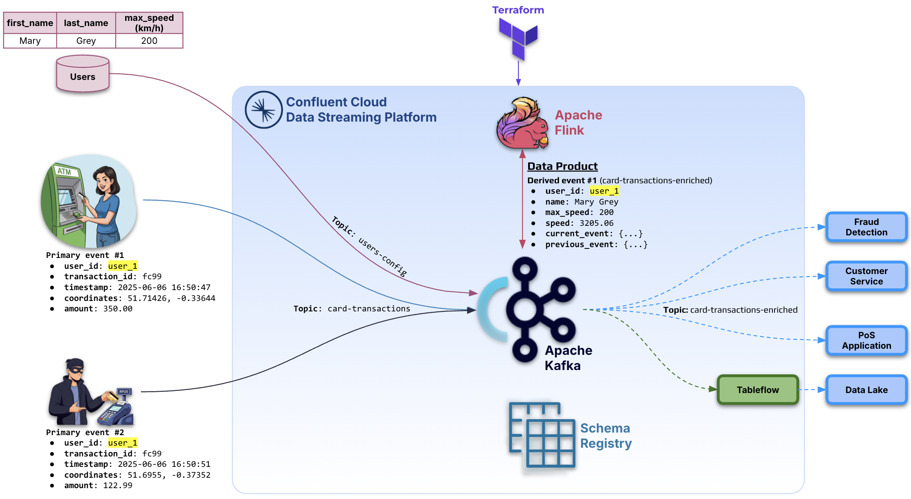
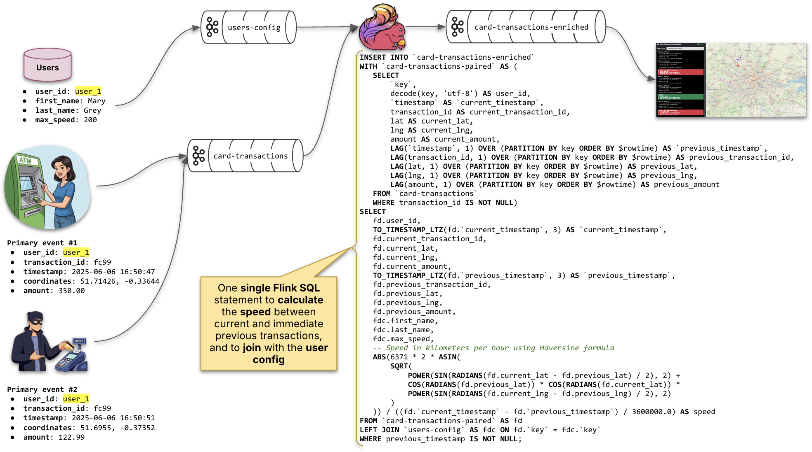
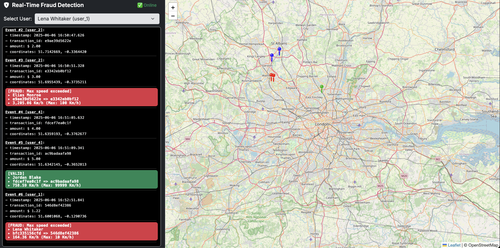

# Real-Time Fraud Detection using Confluent Cloud for Flink

[Confluent Cloud](https://www.confluent.io/) is a fully managed data streaming platform, designed to simplify the development and operation of real-time event-driven applications. It offers a unified platform to ingest, store, process, transform, and govern event streams at scale, allowing organisations to build reusable real-time data products. By abstracting the complexities of managing infrastructure, Confluent Cloud enables teams to focus on delivering business value through low-latency, highly reliable data pipelines and services.

This demo showcases a fraud detection use case leveraging Confluent Cloud's Apache Kafka and Apache Flink. In this scenario, credit card transactions are streamed in real-time into Confluent Cloud, where Apache Flink processes them to identify suspicious patterns as they happen. The resulting real-time fraud detection data product is made available to various downstream consumers, including fraud detection systems, customer service teams, and point-of-sale (PoS) applications, which can immediately act, for example, by blocking a fraudulent transaction before it completes. Simultaneously, enriched and verified data can be persisted into a data lake using [Confluent Tableflow](https://docs.confluent.io/cloud/current/topics/tableflow/overview.html), ensuring that both real-time insights and historical analysis are supported.

## Demo Overview

This demo emulates credit card transactions occurring globally, simulating real-time financial activity across various geolocations. Built on an event-driven data architecture, each transaction is represented as an event containing the following key attributes: `user_id`, `timestamp`, `transaction_id`, `amount`, and `GPS coordinates`. These events are streamed into Confluent Cloud, forming the backbone of a dynamic, low-latency pipeline for fraud detection analysis.

There are multiple established approaches to detecting fraudulent transactions, such as analysing credit scores, monitoring average spending within defined time windows, detecting unusual merchant categories, flagging sudden spikes in transaction volume, identifying atypical transaction locations, and even behavioral biometrics like typing speed or device fingerprinting. This demo focuses on one dimension, leveraging real-time geospatial and temporal correlation to detect anomalies in transaction speed.

A Flink SQL streaming application processes these incoming events by correlating each transaction with the user's previous transaction. By means of leveraging the timestamp and GPS coordinates, the application calculates the implied travel speed between the two transactions. This speed is then enriched with additional customer metadata, including the user's name and a configured maximum allowable speed. If the derived speed exceeds the allowed threshold, indicating that a transaction likely could not have occurred based on physical constraints, the system flags it as potentially fraudulent. The resulting fraud detection data product is made available in real time to a web-based fraud detection application, enabling immediate visibility and action.

This example illustrates just one of many possible fraud detection dimensions enabled by the power of event-driven architectures and real-time stream processing with Flink.



## Relevance of the Demo in Real-Life

While this demo focuses on detecting physically improbable transactions by calculating travel speed between two points, the broader architectural pattern demonstrates it is highly relevant to real-world fraud detection, both for in-person and online transactions.

In real-life systems, fraud detection spans multiple dimensions beyond just geospatial analysis. Here are some practical techniques that can be implemented using the same event-driven, real-time approach:

🧠 Behavioral and Pattern-Based Analysis
 - Velocity checks: Flagging multiple transactions from the same card in a short time span.
 - Average spend deviation: Identifying transactions that deviate significantly from a user's historical spending patterns.
 - Time-of-day anomalies: Catching activity that occurs at unusual times for the user (e.g., transactions at 3 AM).

🌐 Online-Specific Fraud Detection
 - IP address and geolocation mismatches: Identifying logins or purchases from new or high-risk regions.
 - Device fingerprinting: Detecting rapid device switching or unknown device usage.
 - Use of anonymous networks: Blocking or flagging transactions originating from VPNs, proxies, or Tor.

🔁 Profile-Based Scoring and Real-Time Rules
 - Maintain stateful aggregates of user behavior using Flink (e.g., rolling averages, session patterns).
 - Enrich each event with historical data and evaluate against fraud rules in real time.
 - Optionally, integrate machine learning models for dynamic fraud scoring.

Ultimately, this demo is designed to showcase how technologies like Apache Kafka and Apache Flink can be leveraged to build flexible, scalable, and real-time fraud detection systems. While it focuses on one specific detection strategy, the same architecture can be extended to support any number of fraud dimensions, from transaction anomalies and behavioral modeling to location-based alerts and predictive scoring.

## Pre-requisites
Before running this demo, ensure you have the following tools and accounts set up:
 - A [Confluent Cloud](https://www.confluent.io/confluent-cloud/tryfree) account. You can sign up for a free trial. This is required to provision the fully managed Kafka and Flink resources used in the demo.
 - [Terraform](https://www.terraform.io). Terraform is used to automate the provisioning of Confluent Cloud infrastructure (Kafka topics, Flink SQL pipelines, etc.).
 - [jq](https://jqlang.github.io/jq/download). This lightweight command-line JSON processor is used to parse API responses and handle configuration variables during setup.
 - [Python +3.9](https://www.python.org/downloads/). Python is used to run the transaction simulator script, which generates and sends credit card transaction events into the data streaming pipeline.

Make sure all tools are properly installed and available in your system's PATH.

📌 Note: This demo was developed and tested on macOS. While it may work on other operating systems, some adjustments might be necessary, particularly for shell commands or environment setup.

## Installation (one-time setup)

These steps only need to be completed once to prepare your local environment for running the demo.

### Install Terraform

If you're using macOS with Homebrew, install Terraform with the following commands:

```shell
brew tap hashicorp/tap
brew install hashicorp/tap/terraform
brew update
brew upgrade hashicorp/tap/terraform
```

📌 Note: You can verify the installation by running terraform -version.

### Install jq

Install jq, a lightweight command-line JSON processor:

```shell
brew install jq
```

📌 Note: You can verify the installation with jq --version.

### Python setup

After downloading and installing Python +3.9, set up a virtual Python environment and install required dependencies:

```sh
python3 -m venv .venv
source .venv/bin/activate
pip install --upgrade pip
pip install -r requirements.txt
deactivate
```

📌 Note: Activating the virtual environment is only needed when running Python scripts (e.g., the transaction generator).

### Set environment variables

Before provisioning resources with Terraform, you need to create a Confluent Cloud API Key with permissions to manage:
 - Environment
 - Kafka cluster, topics, service accounts, RBACs and client API keys
 - Schema Registry and AVRO schemas
 - Flink compute pool and SQL statements

Once you've created the API key in the Confluent Cloud Console, set your environment variables by creating a `.env` file, make sure to have the placeholders replaced by the appropriate values:

```sh
cat > ./.env <<EOF
#!/bin/bash
export CONFLUENT_CLOUD_API_KEY="<YOUR_CONFLUENT_CLOUD_API_KEY_HERE>"
export CONFLUENT_CLOUD_API_SECRET="<YOUR_CONFLUENT_CLOUD_API_SECRET_HERE>"
EOF
```

### Provision Confluent Cloud resources (Terraform)

With all tools installed and environment variables set, you can now provision the required Confluent Cloud infrastructure using Terraform.

Run the following commands:

```sh
terraform init
source .env
terraform plan
terraform apply --auto-approve
terraform output -json > tf_aws_data.json
./set_config.sh
```

What these commands do:
 - `terraform init`: Initialises the Terraform working directory and downloads required providers.
 - `source .env`: Loads your API key and secret into the environment for Terraform to use.
 - `terraform plan`: Shows the execution plan of resources to be created.
 - `terraform apply --auto-approve`: Provisions the resources in Confluent Cloud without manual confirmation.
 - `terraform output -json > tf_aws_data.json`: Exports the output variables from Terraform into a local JSON file.
 - `./set_config.sh`: Generates a local configuration file (`./config/tf_config.yml`) with required credentials and endpoint information for the fraud detection web application.

⚠️ Note: Provisioning can take a few minutes depending on service availability and quota limits.

💡 Note: If `./set_config.sh` fails or you are running the script on Windows, you can manually create the configuration file. Copy `./config/template.yml` to `./config/tf_config.yml` and replace the placeholder variables (prefixed with `$`) with their corresponding values from the `./tf_aws_data.json` file.

After provisioning resources via Terraform, a Confluent Cloud environment named `env-demo-card-transactions-XXXXXXXX` (where `XXXXXXXX` are random hexadecimal characters) will be created. Within this environment, a BASIC Kafka cluster named `cc-demo-main` is set up, containing the topics: `card-transactions`, `card-transactions-enriched`, and `users-config`. Additionally, a Flink compute pool called `standard_compute_pool` with 5 CFUs is provisioned. The setup also includes the creation of necessary service accounts, RBAC roles, and API keys to securely manage and operate the infrastructure.

The Flink SQL Fraud detection application outputs the data product to the topic `card-transactions-enriched`. The complete SQL statement can be found at the file [./sql/insert_card-transactions-enriched.sql](https://github.com/ifnesi/flink-fraud-detection/blob/main/sql/insert_card-transactions-enriched.sql).

 The Python consumer in this demo is configured with the Kafka setting `isolation.level: read_uncommitted`. This is because Confluent Cloud's Apache Flink writes to Kafka using transactions that are committed only during checkpointing. By default, in Confluent Cloud, Flink performs checkpoints every 60 seconds. During this time, uncommitted transactional messages are visible only if the consumer's isolation level allows it.
 - The Confluent Cloud Web UI does not use `read_committed` isolation, meaning it reads all messages regardless of transaction state.
 - The same applies for the Python consumer to avoid waiting for Kafka transaction commits during processing.

For customers requiring lower latency, the Flink checkpoint interval can be reduced (for example, to 10 seconds), allowing transactional commits, and thus visibility of new data, to occur more frequently.

### Start the Fraud Detection Web Application

Activate the Python virtual environment and run the web application with the desired options:

```sh
source .venv/bin/activate
python3 app.py --config ./config/tf_config.yml --users --dummy 250
```

Explanation of the command options:
 - `--config` CONFIG_FILE
Path to the configuration file generated during provisioning (default: ./config/tf_config.yml).
 - `--dummy` DUMMY_RECORDS
Generate the specified number of dummy transaction records for testing (e.g., 250). Since this demo starts with an empty Kafka topic, Flink requires at least this many records to process and emit meaningful results using the over function.
 - `--users`
Upsert (create/update) users based on the configuration file.

You can see the full help message anytime by running:

```sh
python3 app.py -h
```

### Fraud Detection Web Application

The Fraud Detection Python/Flask application runs locally and is accessible at [http://localhost:8888](http://localhost:8888). Use the dropdown menu to select a user, then double-click anywhere on the map and enter a transaction amount to simulate a credit card transaction at that location (the event will be produced to the topic `card-transactions`). After a pin on the map is shown, repeat the process at a different location. The application will quickly analyse the transaction by calculating the travel speed between the two points and comparing it to the customer's configured maximum speed (and output to the topic `card-transactions-enriched`). It will then indicate whether the transaction is valid or fraudulent based on this speed check.

Below is a high-level diagram of the end-to-end solution.



For simplicity, the demo uses a Python producer to write user configuration data directly into Apache Kafka. In a production environment, this data would typically originate from a database and be ingested using one of Confluent's Change Data Capture (CDC) source connectors. CDC enables seamless, real-time integration of database changes into Kafka topics.

👉 Learn more about CDC and its use cases here: https://www.confluent.io/learn/change-data-capture/

Snapshop of the web application:



To stop the web application, press `CTRL-C` in the terminal where it's running.

### Delete Confluent Cloud resources (Terraform)

After you have finished the demo and testing, you can delete all provisioned resources to avoid incurring costs:

```sh
deactivate
terraform destroy --auto-approve
```

What these commands do:
- `deactivate`: exits the Python virtual environment if active.
- `terraform destroy --auto-approve`: destroys all resources created by Terraform without asking for confirmation.

## External References

Check out [Confluent's Developer portal](https://developer.confluent.io), it has free courses, documents, articles, blogs, podcasts and so many more content to get you up and running with a fully managed Apache Kafka service.

Disclaimer: I work for Confluent :wink:

Apache®, Apache Kafka®, Kafka®, Apache Flink®, Flink®, and the associated Flink and Kafka logos are trademarks of Apache Software Foundation.