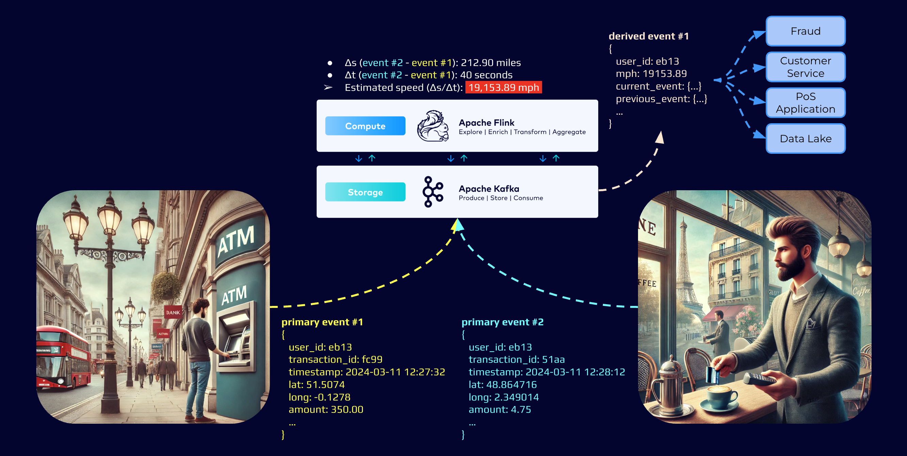

# flink-fraud-detection
Real-Time Fraud Detection using Confluent Cloud for Flink

THIS IS A WORK IN PROGRESS!!!

Initial Setup
```sh
python3 -m venv .venv
source .venv/bin/activate
pip install --upgrade pip
pip install -r requirements.txt
deactivate
```

Create the env file
```sh
cat > ./.env <<EOF
#!/bin/bash
export CONFLUENT_CLOUD_API_KEY="<CONFLUENT_CLOUD_API_KEY>"
export CONFLUENT_CLOUD_API_SECRET="<CONFLUENT_CLOUD_API_SECRET>"
EOF
```

Provision Confluent Cloud resources (Terraform)
```sh
terraform init
source .env
terraform plan
terraform apply --auto-approve
terraform output -json > tf_aws_data.json
./set_config.sh
```

Start Web application
```sh
source .venv/bin/activate
python3 app.py --config ./config/tf_config.yml --users --dummy 250
deactivate
```

Delete Confluent Cloud resources (Terraform)
```sh
terraform apply --auto-approve
```




## External References
Check out [Confluent's Developer portal](https://developer.confluent.io), it has free courses, documents, articles, blogs, podcasts and so many more content to get you up and running with a fully managed Apache Kafka service.

Disclaimer: I work for Confluent :wink:
